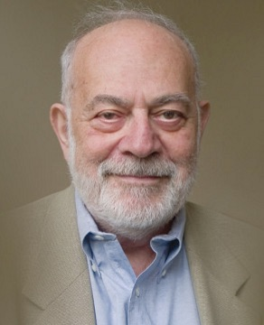
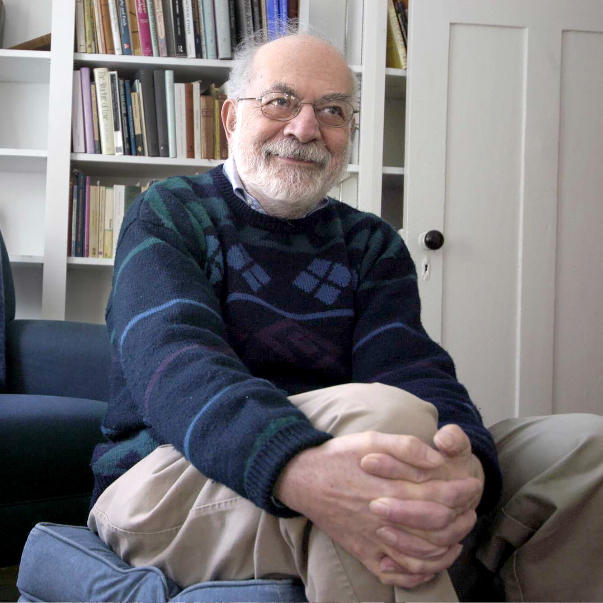
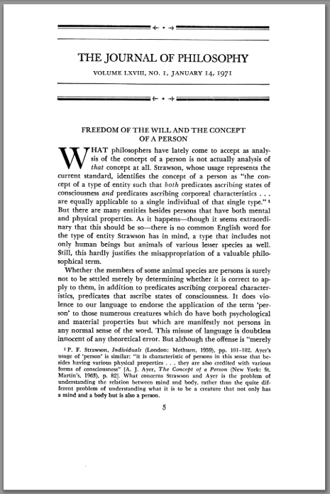
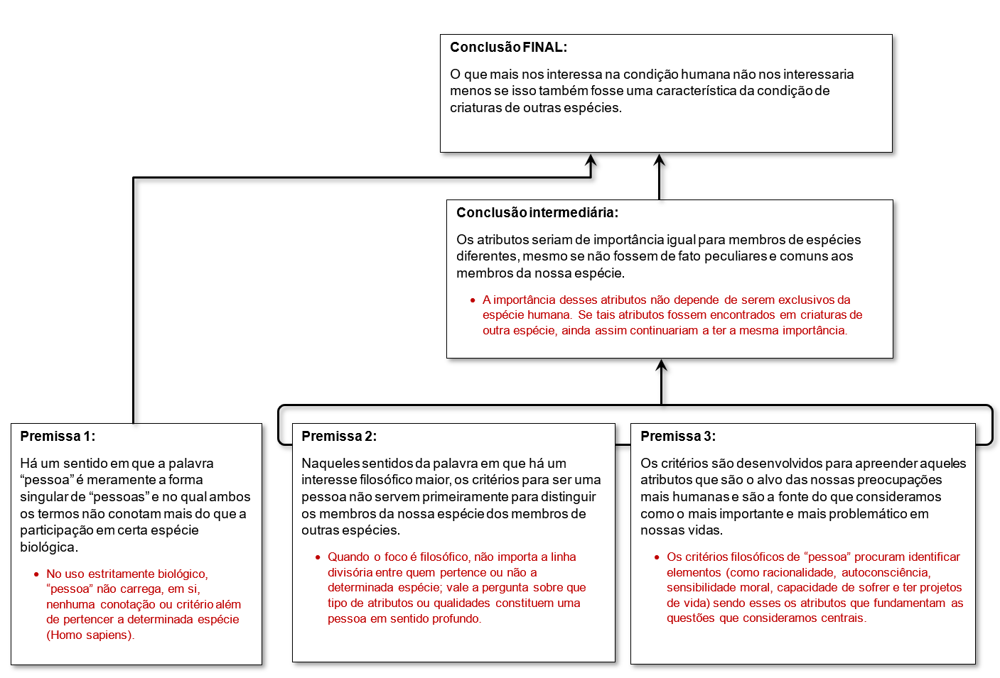
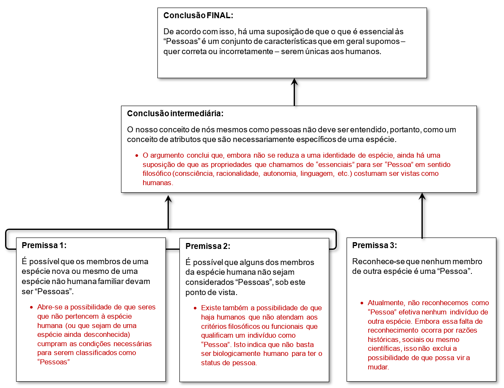
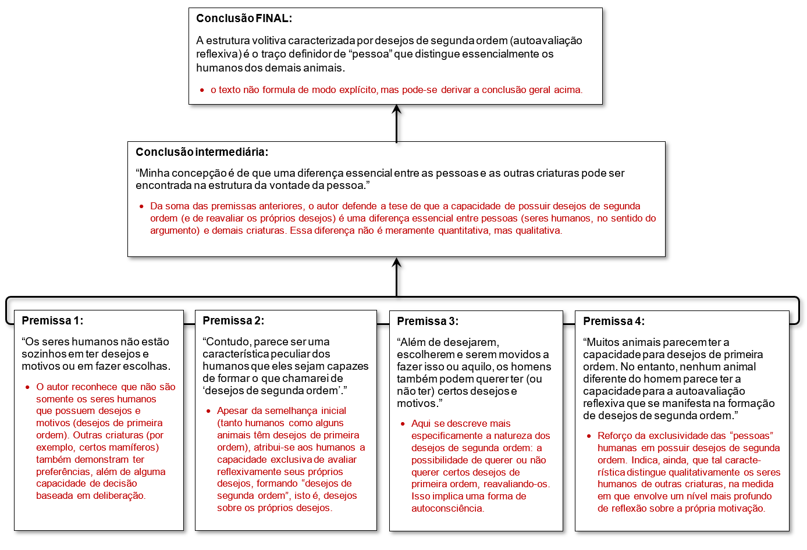

<!-- _class: title-academic -->
<!-- _backgroundColor: white  -->

 Liberdade da Vontade e o Conceito de Pessoa  

 Frankfurt, compatibilismo e desejos de 2ª ordem 
 

 Paulo Roberto M. Cunha 

 27.mar.2025

 Historia da Filosofia Contemporanea II   Bacharelado em Filosofia - UFPA

---

<!-- _class: title  -->

# Liberdade da Vontade e o Conceito de Pessoa
## Este é um subtítulo

---

# Harry Gordon Frankfurt 
- David Bernard Stern (orig.)
- EUA **1929** - **2023** (94 anos);
- Professor emérito de filosofia da Universidade de **Princeton**;

- Conceito de **Higher-order volition**   (vontade de segunda ordem);

&nbsp;
> [Link para uma biografia na Universidade de Princeton.](https://philosophy.princeton.edu/about/great-and-good/harry-gordon-frankfurt)

---

# Ideias

- Compatibilismo
- Decartes e o Livre Arbítrio;
- Conceito de Pessoa;
- Responsabilidade Moral;
- A atitude de **cuidar** desempenhou um papel central em sua filosofia.

# 
#### O **sentido existencial** e a **atribuição de significado** estão ligados ao ato de **preocupar-se** e considerar importante. 
 

---

---

- FRANKFURT, Harry G. **Freedom of the Will and the Concept of the Person**. The Journal of Philosophy, [s. l.], v.&nbsp;68, n.&nbsp;1, p.&nbsp;5–20, 1971. 

---

# Compatibilismo

- ### Compatibilismo é a crença de que o **livre-arbítrio** e o **determinismo casual** são mutuamente **compatíveis** e que é possível **acreditar** em ambos sem ser **logicamente inconsistente**. 
 

  - ### `Vontades de segunda ordem` $\implies$ determinismo causal.
  - ### `Livre-arbítrio` $\implies$ Responsabilidade moral.
---

# Pessoa

- ### [...] uma pessoa é alguém que tem **volições de segunda ordem** ou que se **preocupa** com os **desejos** que tem. 

- ### Ele contrasta as **pessoas** com os **devassos** (*wantons*1) como seres que **têm desejos**, mas **não se importam** com qual de seus **desejos** é traduzido em **ação**.  

&nbsp;

> 1 <i><b>**Wanton**</b></i>: <i><b>devasso</b></i>, <i><b>depravado</b></i>, <i><b>pervertido</b></i> - quem causa danos ou prejuízos deliberadamente e sem motivo aceitável.

---

# Higher-order volitions

- ## **"Vontades de segunda ordem"** são vontades que determinam vontades;

- ## Contraposição às **vontades** que determinam a **ação**;

---

# Vontade Livre **Genuína**

## "A **vontade livre genuína** requer mais do que   simplesmente ter as suas ações determinadas   por suas **vontades** ou seus **desejos**". 

#

## `Vontades ou Desejos` 
$\Downarrow$
## **Ações**

---

# Vontade Livre **Genuína**

## É exigido também que os seus **desejos comuns** sejam eles mesmos **determinados** por **desejos de “segunda ordem”**: 

 

`Desejos mais reflexivos`   <small>(vontade de segunda-ordem)</small>   $\Downarrow$

`Vontades ou Desejos`  <small>(vontade de primeira-ordem)</small>    $\Downarrow$    **Ações**

---

&nbsp;

## <!-- fit --> "**Livre** é quem tem suas **ações** em **conformidade**   com seus desejos **mais reflexivos**"

(Visão de Frankfurt sobre o Compatibilismo)

---

<!-- _class: chapter -->

# Conceito de Pessoa

## **Argumento 01**

---

# Análise do Argumento 01:

- ## O *trecho 01* apresenta **dois modos** de **entender** a palavra **“Pessoa”** e, com isso, distingue **aspectos puramente biológicos** de **aspectos filosófico-existenciais**. 

---

<!-- footer: "" -->

# Argumentação 01:

* ### `Premissa 1:` **“Pessoa”** pode ter um **sentido** puramente **biológico**;

*	### `Premissa 2:` Do ponto de  vista **filosófico**, a questão **“o que é Pessoa?”** não se resolve apenas pelos laços de espécie;

*	### `Premissa 3:`  Os critérios para definir **“Pessoa”**, em sentido filosófico, devem abordar **propriedades** e **capacidades** que consideramos **centrais** para nossas preocupações humanas profundas (valores morais, existência, dignidade etc.);

--- 

# Argumentação 01: <small>(continuação) </small>

* ### `(Conclusão intermediária)`   Tais **atributos** não perdem a sua **importância** caso sejam **compartilhados** com outras **espécies**;

*	### `(Conclusão final)`   Portanto, tudo que consideramos **valioso** na **condição humana** continuaria importante, ainda que descobríssemos que seres não humanos **compartilham** dessas mesmas **características**.

---

<!-- _backgroundColor: white -->

---

<!-- _class: chapter -->

# Conceito de Pessoa
## Argumento 02

---
<!-- _class: quote  -->

O **trecho 02** discute a questão de se o conceito de “pessoa” **depende de pertencer necessariamente a uma única espécie** ou se é possível concebê-lo de **modo mais amplo**, envolvendo **critérios** que podem ou *não* coincidir com a divisão estritamente **biológica**. 

---

# Argumentação 02: 

*	### `Premissa 1: ` Há cenários **conceitualmente possíveis** em que **não-humanos** podem ser pessoas.
*	### `Premissa 2: ` Também se admite que **alguns humanos** *não* preencham os critérios de pessoa.
*	### `Premissa 3: ` Apesar dessa abertura conceitual, na prática, *não* reconhecemos formalmente nenhuma **outra espécie** como possuidora de pessoas.

---

# Argumentação 02: <small>(continuação) </small>

*	### `(Conclusão intermediária) `   Conclui-se que ser pessoa não é algo que **dependa intrinsecamente** de uma definição estrita de **espécie**.

*	### `(Conclusão final)`   De todo modo, a **concepção de pessoa** se baseia num conjunto de **características** (Ex: consciência moral, racionalidade, linguagem, etc.) que, certa ou erradamente, **costumamos** atribuir **exclusivamente** aos humanos.

---

<!-- _backgroundColor: white -->

---

<!-- _class: chapter -->

# Conceito de Pessoa
## Argumento 03

---

# Análise do Argumento 03

- ### O *trecho 03* propõe uma **distinção** entre **pessoas** (particularmente, os seres humanos) e **outras criaturas** baseada na *“estrutura da vontade”* – em especial, na **capacidade de formar desejos de segunda ordem**. 

---

# Argumentação 03: 

*	### `(Premissa 1)`   Tanto **humanos** quanto outras **espécies** possuem **desejos** e **motivações**.

*	### `(Premissa 2)`   Contudo, os humanos têm algo além disso: **desejos de segunda ordem**.

*	### `(Premissa 3)`   Esses **desejos de segunda ordem** implicam querer ou não querer **determinados desejos**.

---

# Argumentação 03: <small>(continuação) </small>

*	#### `(Premissa 4)`   **Somente os humanos** exibem essa capacidade de **autoavaliação reflexiva**, distinguindo-se dos **animais** que **só possuem** desejos de primeira ordem.

*	#### `(Conclusão intermediária)`   Disso decorre que há uma **diferença essencial** na *“estrutura da vontade”* das pessoas, em contraste com as **demais criaturas**.

*	#### `(Conclusão Geral)`   A capacidade de formar **desejos de segunda ordem** é o traço definidor que sustenta a **diferença essencial** entre “Pessoas” (no sentido filosofico) e **animais** não humanos.

---

<!-- _backgroundColor: white -->

---

<!-- _class: biblio -->

# Referências

- FRANKFURT, Harry G. Freedom of the Will and the Concept of the Person. **The Journal of Philosophy**, [s. l.], v. 68, n. 1, p. 5–20, 1971.

- FRANKFURT, Harry G. **The Reasons of Love**. Princeton, New Jersey: Princeton University Press, 2004. 

- [American Academy in Berlin](https://www.americanacademy.de/person/harry-frankfurt/).
- [Compatibilism](https://en.wikipedia.org/wiki/Compatibilism).
- [Frankfurter Rundschau](https://www.fr.de/kultur/gesellschaft/wenn-alle-ueberall-mitreden-92408959.html).
- [Higher-order volition](https://en.wikipedia.org/wiki/Higher-order_volition)
- [Penguin Publisher](https://www.penguinrandomhouse.ca/authors/74530/harry-g-frankfurt)
- [Princeton University](https://philosophy.princeton.edu/about/great-and-good/harry-gordon-frankfurt).
- [Suhrkamp Verlag](https://www.suhrkamp.de/person/harry-g-frankfurt-p-1300)
- [The New York Times. Obtuary](https://www.nytimes.com/2023/07/17/books/harry-g-frankfurt-dead.html?auth=login-google1tap&login=google1tap#).
- [The Washington Post. Obtuary](https://www.washingtonpost.com/obituaries/2023/07/18/harry-frankfurt-philosopher-author-bull/).

---

<!-- _backgroundColor: white -->

## <!-- fit -->  [Obrigado!](#1)

